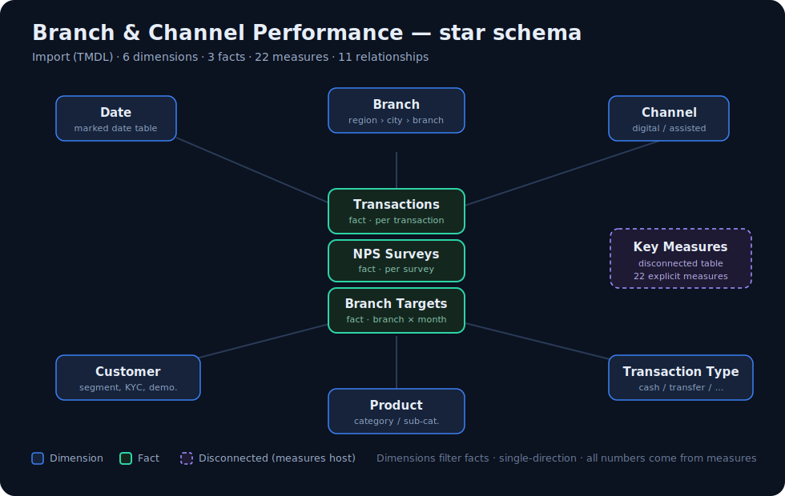

# datapot-fabric-agent-demo

### Power BI reports, built by an AI agent — as reviewable code, not clicks.

[](LICENSE)


-F2C811)


A Microsoft Fabric / Power BI monorepo where every semantic model and report is authored by
**Claude Code** in diff-able **PBIP** format (TMDL + PBIR) — then validated, documented, and
version-controlled like software. **Report 01** is a banking **Branch &amp; Channel Performance**
dashboard built end-to-end on a 100% AI-generated dataset.

📖 **See exactly how it was built** — prompts, debug log, and cost: **[`docs/session-recap.html`](docs/session-recap.html)** *(open locally in a browser for the full rendered recap).*

> 🔬 **Research &amp; educational use only · 100% dummy data.** Experimental; **not production-tier**
> and not through Datapot's QA. The bundled "BankDIAD" dataset is entirely AI-generated — no real
> people, customers, or institution. Don't use the model or numbers for real decisions. No warranty.
> [Full notice ↓](#-data--status-notice)

---

## What it produces

A clean, conventional **star schema** — 6 dimensions, 3 facts, and a disconnected measures table:

<p align="center">
  
</p>

The report has three pages — **Overview**, **Channel Performance**, and **Branch Scorecard**
(31 visuals). Open `BranchChannelPerformance.pbip` to explore them ([Getting Started ↓](#getting-started--open--explore-report-01)),
or skim the [build recap](docs/session-recap.html) for the visuals and story.

## What you'll learn

A worked, end-to-end example of **agentic analytics engineering** on the Microsoft data platform:

- 🧱 **PBIP as code** — how a Power BI model + report look as reviewable TMDL/PBIR files, not a binary `.pbix`.
- ⭐ **Star-schema modeling** — 6 dimensions, 3 facts, hidden surrogate keys, explicit measures only.
- 🧮 **DAX measure design** — 22 measures in display folders (volume · revenue &amp; targets · service/NPS · digital adoption · time intelligence).
- 📒 **Spec-driven, documented builds** — dataset contract → data profile → model design → report spec → build log → data dictionary.
- 🤖 **The agent workflow** — the actual prompts, debug log, and cost ([recap](docs/session-recap.html)).
- 🧰 **Reusable conventions** — folder, naming, TMDL &amp; PBIR rules that keep a multi-report repo consistent ([CONVENTIONS.md](CONVENTIONS.md)).

## Getting Started — open &amp; explore Report 01

**Prerequisites**
- **Power BI Desktop** (latest; free from the Microsoft Store).
- The **PBIR preview features** enabled (one-time, below) — required, or the report won't open.
- *(Optional)* Python 3 + `openpyxl` — only to run `validate_pbip.py` or regenerate the dummy data; **not** needed to open/refresh the report.

**1. Clone**
```bash
git clone https://github.com/DatapotAnalytics/datapot-fabric-agent-demo.git
cd datapot-fabric-agent-demo
```

**2. Enable the PBIR preview (one-time, required)** — in Power BI Desktop:
*File ▸ Options and settings ▸ Options ▸ Preview features* → tick **Power BI Project (.pbip) save option**
and **Store reports using enhanced metadata format (PBIR)** → **OK** → **restart Desktop**.
*(Skip this and Desktop may refuse to open the project or show "The report has no pages".)*

**3. Open the project** — `reports/01-branch-channel-performance/pbip/BranchChannelPerformance.pbip`

**4. Point the model at your clone (required)** — the data path is parameterized. On the ribbon:
**Home ▸ Transform data ▸ Edit parameters**, set **`DataFolder`** to the absolute path of the
raw-data folder in *your* clone, e.g.
```
C:\Users\<you>\src\datapot-fabric-agent-demo\reports\01-branch-channel-performance\dataset\raw
```

**5. Refresh** — **Home ▸ Refresh**. The dummy data loads (36 monthly partitions, 2023-01 → 2025-12).
It's 100% synthetic, so open and refresh with no privacy concerns.

### The three pages
1. **Overview** — headline volume &amp; value: KPI cards (Total Transactions, Gross Transaction Value, NPS, Digital Adoption %), a monthly trend, a by-channel breakdown, and a Year slicer. *How much is flowing, and how is it trending?*
2. **Channel Performance** — the digital shift: digital-adoption KPIs, a 100% stacked column of channel mix over time, volume &amp; average service time by channel, and a Channel × Transaction-Category matrix. *How much activity is digital, and is it growing?*
3. **Branch Scorecard** — per-branch performance: a Region › City › Branch scorecard matrix, NPS by branch, and a detractor-reason breakdown. *Which branches lag on service, NPS, and targets?*

## Repository layout

```
datapot-fabric-agent-demo/
├── README.md                  ← you are here
├── CLAUDE.md                  ← how an agent (or human) should work in this repo
├── CONVENTIONS.md             ← naming, folder, PBIP/TMDL & dictionary standards
├── CONTRIBUTING.md · SECURITY.md · CODE_OF_CONDUCT.md · CHANGELOG.md · LICENSE
├── docs/                      ← repo-wide docs
│   ├── report-lifecycle.md    ← design → dataset → model → report → deploy
│   ├── business-glossary.md   ← banking terms shared across reports
│   ├── fabric-environment.md  ← target workspaces / deployment (fill in per tenant)
│   ├── assets/                ← diagrams (star-schema.svg)
│   └── session-recap.html     ← how this build actually went (prompts, debug log, cost)
├── shared/                    ← assets reused by every report
│   ├── themes/                ← the Datapot brand Power BI theme
│   └── templates/             ← starter files for a new report
└── reports/                   ← ALL reports live here, one folder each
    ├── README.md              ← report registry / index
    └── 01-branch-channel-performance/
        ├── dataset/  dictionary/  docs/  pbip/   (+ README.md)
```

## The per-report contract

Each report folder always carries these four things — nothing leaks between reports:

| Component      | Folder             | What it is |
|----------------|--------------------|------------|
| **Folder**     | `reports/NN-name/` | One numbered folder per report |
| **Dataset**    | `dataset/`         | Source data + `DATASET-CONTRACT.md` describing the expected files/columns |
| **Document**   | `docs/`            | `report-spec.md`, `model-design.md`, `build-log.md`, `data-profile.md` |
| **Dictionary** | `dictionary/`      | `data-dictionary.md` + `.csv` — every table, column, and measure defined |

Power BI artifacts (semantic model + report) live in `pbip/` as source-controllable **PBIP**
(TMDL semantic model + PBIR report).

## Reports

| # | Report | Domain | Status |
|---|--------|--------|--------|
| 01 | [Branch &amp; Channel Performance](reports/01-branch-channel-performance/README.md) | Banking | 🟢 Complete — 3 pages; opens &amp; refreshes in Power BI Desktop |
| 02 | _(planned)_ | _TBD_ | 🔴 Ideas welcome — [open an issue](https://github.com/DatapotAnalytics/datapot-fabric-agent-demo/issues/new/choose) |

New reports are added as self-contained folders over time — ⭐ **star / watch** to follow along.
Legend: 🔴 planned · 🟡 in progress · 🟢 built. Full registry: [reports/README.md](reports/README.md).

## Adding a new report

See [CONVENTIONS.md](CONVENTIONS.md) and [docs/report-lifecycle.md](docs/report-lifecycle.md): copy
`shared/templates/` into a new `reports/NN-name/`, write the dataset contract, paste &amp; **profile**
data, build the TMDL model, then the PBIR report, validate, and (optionally) publish to Fabric.
Contributions welcome — start with [CONTRIBUTING.md](CONTRIBUTING.md).

<details>
<summary><b>Local development &amp; validation (contributors)</b></summary>

```bash
tmdl-validate <file>.tmdl                                   # TMDL structural lint
python validate_pbip.py reports/NN-name/pbip --no-pbir-cli  # whole-project check (0 errors)
jq empty <file>.json                                        # PBIR JSON syntax
```

**Windows / Claude Code note:** if your clone path contains non-ASCII characters or spaces, the
pbip plugin's PostToolUse PBIR hook may mis-read it and emit *false* "missing field" errors on
`.pbir` / `.Report` writes — the files are fine if `jq empty` and `validate_pbip.py` pass. See
[CLAUDE.md](CLAUDE.md) for the full TMDL/PBIR rule set (folder naming, LF/no-BOM, theme metadata).
</details>

## About Datapot

[**Datapot Analytics**](https://datapot.edu.vn) is a Vietnam-based data-analytics training and
consulting company. We help people and teams become fluent in modern analytics — SQL, Power BI,
data modelling, and the Microsoft data platform. This repo is part of our **applied research into
agentic, AI-assisted analytics engineering**, shared openly so the community can learn the workflow
— what works, what breaks, and why.

## Explore &amp; contribute

- ⭐ **Star this repo** if the agentic-PBIP workflow is useful — it helps others find it.
- 🔎 **Explore Report 01** → [Branch &amp; Channel Performance](reports/01-branch-channel-performance/README.md)
- 📖 **Read the build story** → [session recap](docs/session-recap.html)
- 🎓 **Learn analytics with us** → [datapot.edu.vn](https://datapot.edu.vn)
- 💬 **Bug or idea?** → [open an issue](https://github.com/DatapotAnalytics/datapot-fabric-agent-demo/issues/new/choose) · see [CONTRIBUTING.md](CONTRIBUTING.md)

## License

Code is released under the [MIT License](LICENSE). The bundled BankDIAD dataset is 100% synthetic and
free to reuse for learning. Documentation and report content © Datapot Analytics — reuse encouraged
with attribution.

## 🔬 Data &amp; status notice

This repository is an **experimental, research-purpose** project. It is **not production-tier** and
has **not** passed Datapot's own production standards / QA workflow. Structure, models, conventions,
and data may change at any time without notice. Do not rely on this repository, its model, or its
numbers for real decisions. **No warranty; use at your own risk.**

**Data:** the bundled "BankDIAD" dataset is **100% dummy, AI-generated data** — every name, date of
birth, balance, branch, and value is fabricated for demonstration. It contains **no real, private, or
personal data**, represents no real customers or institution, and violates no one's privacy.
