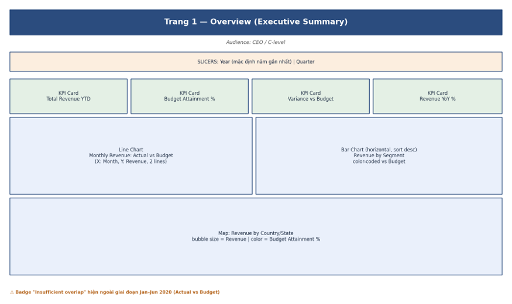
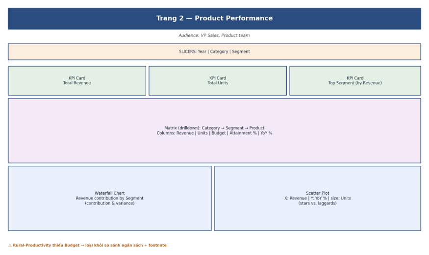
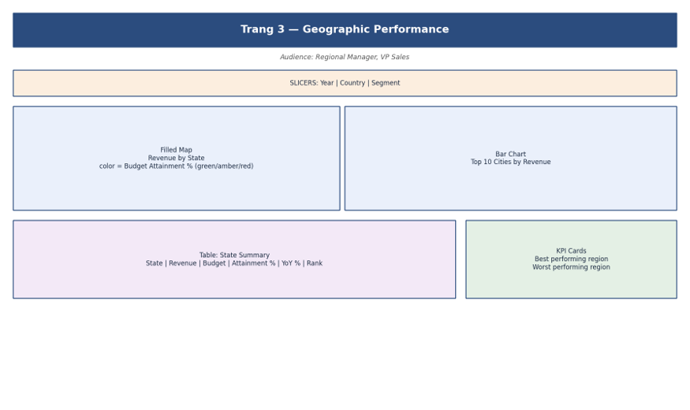
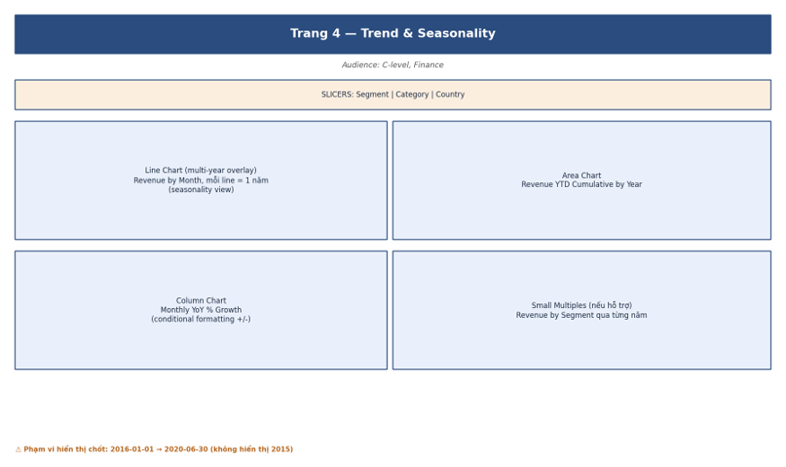
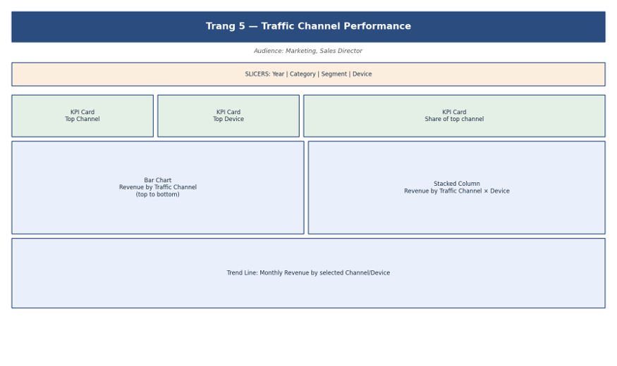
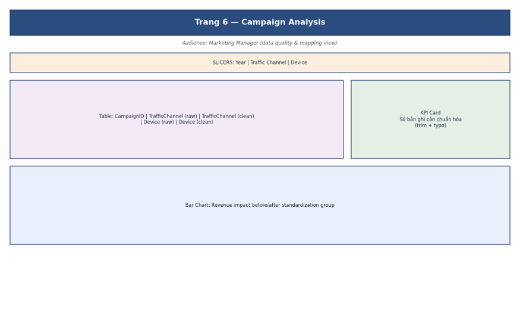
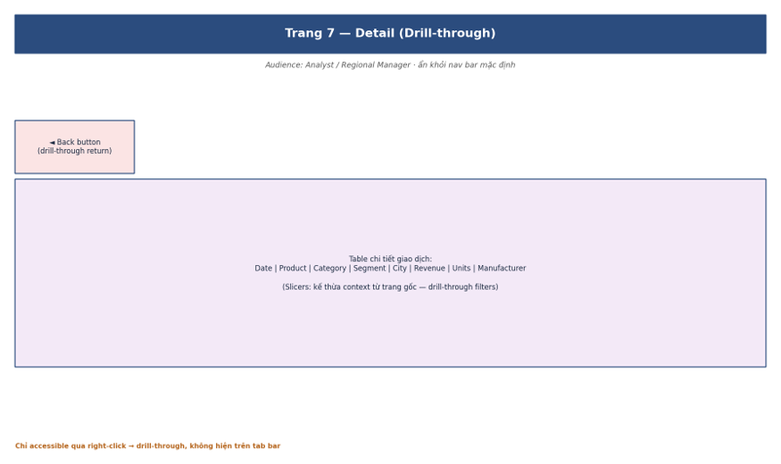

# Wireframe / Mockup — VanArsdel Executive Dashboard

Layout phác thảo cho từng page. Mỗi visual được chú thích metric và chiều dữ liệu hiển thị.
Kích thước page: 1280 × 720 px (16:9).

## Page 1 — Overview (Executive Summary)

Purpose: Bức tranh tổng quan — Revenue vs. Budget, trend, và top contributors.  
Audience: CEO / C-level.

Visuals:
- KPI cards: Total Revenue YTD, Budget Attainment %, Variance vs Budget, Revenue YoY %
- Line chart Monthly Revenue: Actual vs Budget
- Bar chart Revenue by Segment (horizontal, sort desc, color-coded vs budget)
- Map Revenue by Country/State (bubble size = Revenue, color = Budget Attainment %)

Slicers: Year (default: latest), Quarter.

Data note: Hiển thị badge `Insufficient overlap` ngoài giai đoạn Jan-Jun 2020 khi so sánh Actual vs Budget.

## Page 2 — Product Performance

Purpose: Drill-down vào hiệu suất theo phân cấp sản phẩm.  
Audience: VP Sales, Product team.

Visuals:
- KPI cards: Total Revenue, Total Units, Top Segment
- Matrix drilldown Category → Segment → Product (Revenue, Units, Budget, Attainment %, YoY %)
- Waterfall chart Revenue contribution by Segment
- Scatter plot Category performance (X: Revenue, Y: YoY %, size: Units)

Slicers: Year, Category, Segment.

Data note: `Rural-Productivity` thiếu cột budget; loại khỏi visual/KPI so sánh ngân sách và gắn footnote.

## Page 3 — Geographic Performance

Purpose: Phân tích theo vùng địa lý.  
Audience: Regional Manager, VP Sales.

Visuals:
- Filled map Revenue by State (color = Budget Attainment %)
- Bar chart Top 10 Cities by Revenue
- Table State summary (State, Revenue, Budget, Attainment %, YoY %, Rank)
- KPI card Best/Worst performing region

Slicers: Year, Country, Segment.

## Page 4 — Trend & Seasonality

Purpose: Phân tích xu hướng dài hạn và tính mùa vụ.  
Audience: C-level, Finance.

Visuals:
- Line chart multi-year overlay Revenue by Month (mỗi line = 1 năm)
- Area chart Revenue YTD cumulative by year
- Column chart Monthly YoY % Growth (conditional formatting)
- Small multiples Revenue by Segment qua từng năm

Slicers: Segment, Category, Country.

Data note: Phạm vi hiển thị chốt `2016-01-01` → `2020-06-30`; không hiển thị năm 2015.

## Page 5 — Traffic Channel Performance

Purpose: Đánh giá hiệu suất nguồn lưu lượng và thiết bị.  
Audience: Marketing, Sales Director.

Visuals:
- Bar chart Revenue by Traffic Channel
- Stacked column Revenue by Traffic Channel x Device
- Trend line Monthly Revenue by selected channel/device
- KPI cards Top Channel, Top Device, Share of top channel

Slicers: Year, Category, Segment, Device.

## Page 6 — Campaign Analysis

Purpose: Data quality & mapping view cho Campaign dimension.  
Audience: Marketing Manager.

Visuals:
- Table CampaignID, TrafficChannel (raw), TrafficChannel (clean), Device (raw), Device (clean)
- KPI card số bản ghi cần chuẩn hóa (trim + typo)
- Bar chart Revenue impact before/after standardization group

Slicers: Year, Traffic Channel, Device.

## Page 7 — Detail (Drill-through)

Purpose: Bảng chi tiết giao dịch, drill-through từ các page khác.  
Audience: Analyst / Regional Manager.

Visuals:
- Table (Date, Product, Category, Segment, City, Revenue, Units, Manufacturer)
- Back button (drill-through return)

Slicers: Kế thừa context từ trang gốc (drill-through filters).

## Annotation rules

1. Visual nào dùng KPI có điều kiện dữ liệu phải gắn nhãn `Insufficient overlap` nếu ngoài vùng áp dụng.
2. Visual có Budget phải ghi rõ grain áp dụng: Category-Segment x Month.
3. Tooltips của KPI cards phải chứa định nghĩa business metric.

## Color palette (from datapot-theme.json)

| Usage | Color |
|-------|-------|
| Actual / primary metric | Theme primary (blue) |
| Budget | Neutral gray |
| Forecast | Dashed teal |
| Positive / ≥ 100% | Green |
| Warning / 80–99% | Amber |
| Negative / < 80% | Red |
| VanArsdel highlight | Theme accent |
